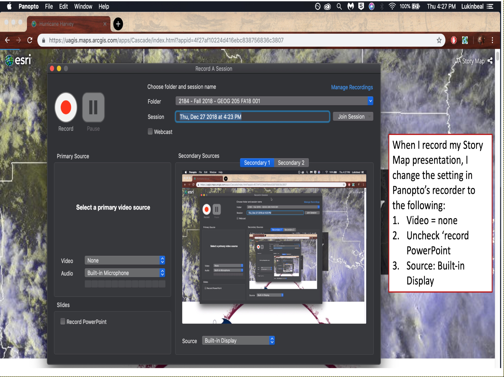
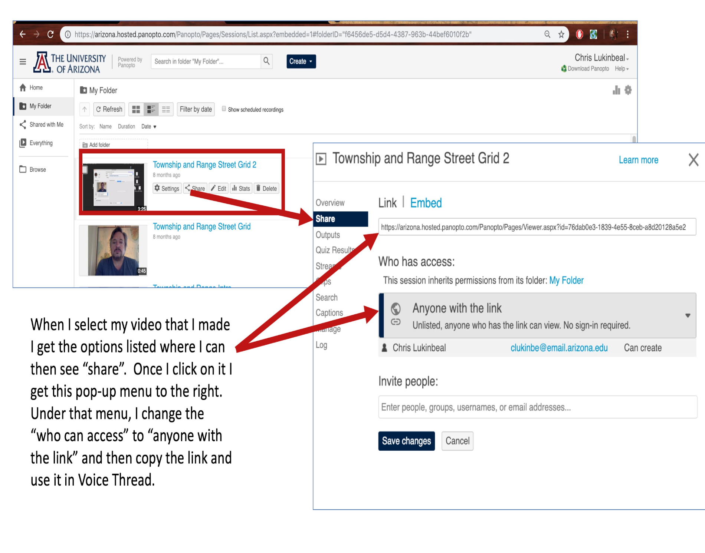

# Instructions for lightning talk:

## Record your talk using Panopto.

Create a 3-minute presentation. The key is short and concise. Your report can have more detail if you want to share more, but please keep the presentation brief.
The format is up to you but the key point for this class is Methods. That said, this would be a very standard report format.

- Problem statement
- Methods, including data, software, and algorithms or techniques
- Results
- Discussion
- Conclusion

### How to record your talk

Use the D2l Panopto Link on the class webpage to Open Panopto (You will have to download it first). 
[Background for using Panopto](https://help.d2l.arizona.edu/content/students-panopto)

When you start your recording, choose options like this:


To share your link, see this image:



## Create a new branch named `talk` and include a file named `talk.md` with the following:

```
url of your recording
```
